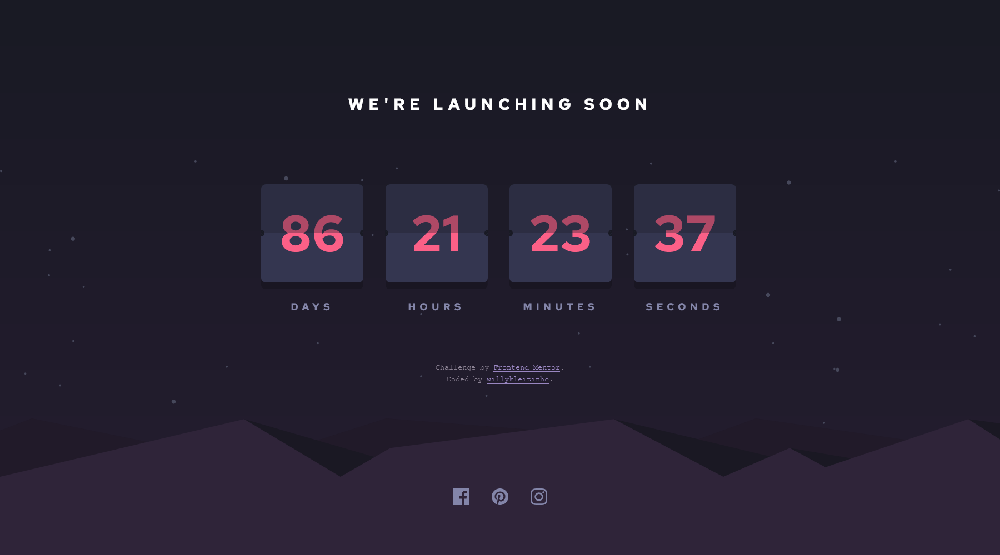

# Frontend Mentor - Launch countdown timer solution

This is a solution to the [Launch countdown timer challenge on Frontend Mentor](https://www.frontendmentor.io/challenges/launch-countdown-timer-N0XkGfyz-). Frontend Mentor challenges help you improve your coding skills by building realistic projects. 

## Table of contents

- [Overview](#overview)
  - [The challenge](#the-challenge)
  - [Screenshot](#screenshot)
  - [Links](#links)
- [My process](#my-process)
  - [Built with](#built-with)
  - [What I learned](#what-i-learned)
  - [Continued development](#continued-development)
- [Author](#author)

## Overview

### The challenge

Users should be able to:

- See hover states for all interactive elements on the page
- See a live countdown timer that ticks down every second (start the count at 14 days)
- **Bonus (to do)**: When a number changes, make the card flip from the middle

### Screenshot



### Links

- Solution URL: [on Frontend Mentor](todo//ajsidaid.com)
- Live Site URL: [on Github Pages](https://willykleitinho.github.io/launch-countdown-timer/)

## My process

### Built with

- Semantic HTML5 markup
- CSS custom properties
- CSS Grid
- Mobile-first workflow

### What I learned

I've learned new things when it comes to auto scaling elements and its children using ```clamp()``` and viewport percentages.

### Continued development

I've tried a few things to do the flipping animation on my own, but I have yet to figure it out.

## Author

- Github - [@willykleitinho](https://github.com/willykleitinho)
- Frontend Mentor - [@willykleitinho](https://www.frontendmentor.io/profile/willykleitinho)